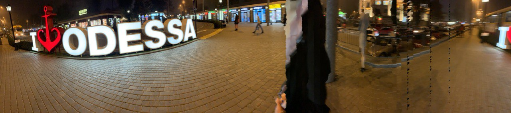

# homework
<!DOCTYPE html>
<html lang="en">

<head>
    <meta charset="Utf-8">
    <title>Valentin Mogilevich</title>
</head>
<title>Valentin Mogilevich</title>

<body>
    <h1>Valentin Mogilevich</h1>
    
 
    

    

    <h2>Front-End Developer (in the future)</h2>
    

        Hello! I'm Valentin Mogilevich. I'm student of <a href="https://beetroot.academy/ru/student">Beetroot</a>
        academy, in the future I will be able to make a website
        of
        <s>any</s> complexity for you. I have a lot of experience in development, as much as two and a half hours.
        During this
        time, I have been able to perfectly <s>comprehend</s> all programming languages ​​known to man.
        For example, here is a list of the most famous:
    <ul>
        <li>C</li>
        <li>Java</li>
        <li>Python</li>
        <li>C++</li>
        <li>C#</li>
        <li>JavaScript</li>
        <li>PHP</li>
        <li>Dart</li>
    </ul>
    <marquee behavior="alternate" direction="left" bgcolor="#ffcc00">
        
<a href="https://ru.wikipedia.org/wiki/%D0%A8%D1%83%D1%82%D0%BA%D0%B0">JOKE JOKE JOKE JOKE JOKE JOKE JOKE
                JOKE JOKE JOKE JOKE JOKE</a>

    </marquee>
    

    <footer>
        

        

            

                
<strong>If you still want to contact me, here are my contacts:
                        <ul>
                            <li>Email mogilevic.valik@gmail.com</li>
                            <li>Telegram @mogilevic</li>
                            <li>Phone +380952030716</li>
                        </ul>
                    </strong>

                
&copy; Valentin Mogilevich

            

        

    </footer>
</body>

</html>
